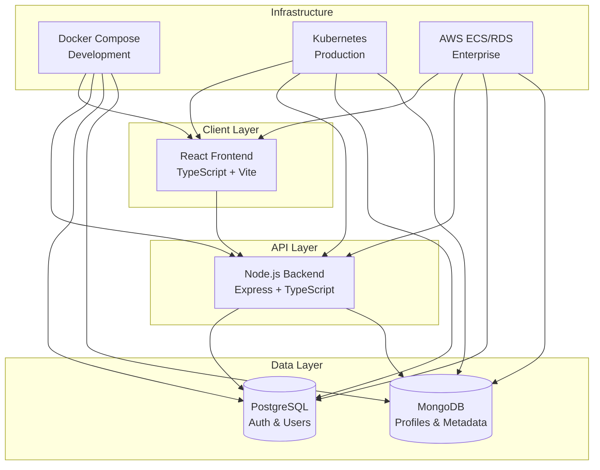

# Enterprise User Management System

A production-ready, scalable user management system built with modern technologies and enterprise-grade infrastructure.

## 🏗️ Architecture Overview



## 🚀 Quick Start

### Prerequisites
- Docker & Docker Compose
- Node.js 20+
- Git

### Development Setup
```bash
# Clone repository
git clone <repository-url>
cd user-management-system

# Start development environment
cd infrastructure/docker
cp .env.dev .env
docker-compose -f docker-compose.dev.yml up -d

# Access applications
# Frontend: http://localhost:3000
# Backend:  http://localhost:8000
# API Docs: http://localhost:8000/api-docs
```

## 📁 Repository Structure

```
user-management-system/
├── backend/                    # Node.js API Server
│   ├── src/                   # Source code
│   │   ├── controllers/       # Route handlers
│   │   ├── services/          # Business logic
│   │   ├── repositories/      # Data access layer
│   │   ├── middleware/        # Express middleware
│   │   └── database/          # DB migrations & seeders
│   ├── tests/                 # Test suites
│   ├── Dockerfile.dev         # Development container
│   ├── Dockerfile.prod        # Production container
│   ├── buildspec.yml          # CI/CD build spec
│   └── package.json
├── frontend/                  # React SPA
│   ├── src/                   # Source code
│   │   ├── components/        # React components
│   │   ├── pages/             # Page components
│   │   ├── services/          # API service layer
│   │   ├── hooks/             # Custom React hooks
│   │   └── types/             # TypeScript definitions
│   ├── public/                # Static assets
│   ├── Dockerfile.dev         # Development container
│   ├── Dockerfile.prod        # Production container
│   ├── buildspec.yml          # CI/CD build spec
│   └── package.json
├── infrastructure/            # Infrastructure as Code
│   ├── docker/                # Docker Compose configs
│   │   ├── docker-compose.dev.yml
│   │   ├── docker-compose.prod.yml
│   │   ├── .env.dev
│   │   └── .env.prod
│   ├── kubernetes/            # K8s manifests
│   │   ├── deployments.yaml
│   │   ├── services.yaml
│   │   ├── ingress.yaml
│   │   └── secrets.yaml
│   ├── terraform/             # AWS infrastructure
│   │   ├── modules/           # Reusable modules
│   │   ├── environments/      # Environment configs
│   │   └── scripts/           # Deployment scripts
│   └── scripts/               # Automation scripts
├── .github/                   # GitHub workflows
│   └── workflows/             # CI/CD pipelines
├── docs/                      # Documentation
│   └── api/                   # API documentation
└── README.md
```

## 🛠️ Technology Stack

### Frontend
- **React 19** - Modern UI framework
- **TypeScript** - Type-safe development
- **Vite** - Fast build tool
- **TailwindCSS** - Utility-first styling
- **TanStack Query** - Server state management

### Backend
- **Node.js 20+** - JavaScript runtime
- **Express.js** - Web framework
- **TypeScript** - Type safety
- **JWT** - Authentication
- **Winston** - Structured logging

### Databases
- **PostgreSQL 15** - User authentication & core data
- **MongoDB 7** - User profiles & dynamic content

### Infrastructure
- **Docker** - Containerization
- **Kubernetes** - Container orchestration
- **AWS ECS** - Managed containers
- **Terraform** - Infrastructure as Code

## 🌟 Key Features

### Authentication & Security
- JWT-based authentication with refresh tokens
- Role-based access control (Super Admin, Admin, User, Guest)
- Password hashing with bcrypt
- Rate limiting and input validation

### User Management
- Complete CRUD operations for users
- Advanced search and filtering
- User profile management
- Account status management
- Audit logging

### Developer Experience
- Hot reload in development
- Comprehensive test coverage
- API documentation with Swagger
- Multi-language support (EN, ES, FR)
- Dark/light theme support

## 🚀 Deployment Options

### 1. Docker Compose (Recommended for Development)
```bash
cd infrastructure/docker
docker-compose -f docker-compose.dev.yml up -d
```

### 2. Kubernetes (Production Ready)
```bash
cd infrastructure/kubernetes
kubectl apply -f .
```

### 3. AWS ECS (Enterprise Scale)
```bash
cd infrastructure/terraform/environments/dev
terraform init
terraform apply
```

## 🧪 Testing

### Backend Tests
```bash
cd backend
npm run test              # All tests
npm run test:unit         # Unit tests
npm run test:integration  # Integration tests
npm run test:e2e          # End-to-end tests
```

### Frontend Tests
```bash
cd frontend
npm test                  # All tests
npm run test:ui           # Test UI
```

## 📊 Database Setup

### Quick Setup (Development)
```bash
cd backend
npm run db:fresh          # Fresh install with seed data
```

### Available Commands
```bash
npm run db:migrate        # Run migrations
npm run db:seed           # Insert demo data
npm run db:status         # Check migration status
npm run db:reset          # Reset database
```

### Default Users
| Role | Email | Password |
|------|-------|----------|
| Super Admin | `admin@usermanagement.local` | `AdminPassword123!` |
| Admin | `demo.admin@usermanagement.local` | `DemoAdmin123!` |
| User | `john.doe@example.com` | `DemoUser123!` |

## 🔧 Development

### Environment Variables
Copy and configure environment files:
```bash
# Backend
cp backend/.env.example backend/.env

# Frontend
cp frontend/.env.local.example frontend/.env.local

# Infrastructure
cp infrastructure/docker/.env.dev infrastructure/docker/.env
```

### API Documentation
- **Local**: http://localhost:8000/api-docs
- **Swagger UI**: Interactive API documentation
- **Postman Collection**: Available in `docs/api/`

## 📈 Monitoring & Logging

### Health Checks
- **Backend**: http://localhost:8000/health
- **Frontend**: http://localhost:3000/health

### Logging
- **Development**: Console output with Winston
- **Production**: Structured JSON logs
- **Audit Trail**: All user actions logged

## 🔐 Security Features

- **HTTPS Enforcement**
- **CORS Configuration**
- **Helmet Security Headers**
- **Input Validation**
- **SQL Injection Prevention**
- **Rate Limiting**
- **Account Lockout**

## 📚 API Reference

### Authentication
```bash
POST /api/auth/login      # User login
POST /api/auth/register   # User registration
POST /api/auth/refresh    # Refresh token
POST /api/auth/logout     # User logout
```

### User Management
```bash
GET    /api/users         # List users
POST   /api/users         # Create user
GET    /api/users/:id     # Get user
PUT    /api/users/:id     # Update user
DELETE /api/users/:id     # Delete user
```

### Profiles
```bash
GET    /api/profiles/:id  # Get user profile
PUT    /api/profiles/:id  # Update profile
```

## 🤝 Contributing

1. Fork the repository
2. Create a feature branch: `git checkout -b feature/amazing-feature`
3. Commit changes: `git commit -m 'Add amazing feature'`
4. Push to branch: `git push origin feature/amazing-feature`
5. Open a Pull Request

## 📄 License

This project is licensed under the MIT License - see the [LICENSE](LICENSE) file for details.

---

## 🆘 Support

### Documentation
- **API Docs**: [docs/api/README.md](docs/api/README.md)
- **Infrastructure**: [infrastructure/README.md](infrastructure/README.md)
- **Backend Guide**: [backend/README.md](backend/README.md)
- **Frontend Guide**: [frontend/README.md](frontend/README.md)

### Quick Commands
```bash
# Start development
./infrastructure/scripts/dev.sh up

# Run tests
npm run test:all

# Deploy production
./infrastructure/scripts/deploy.sh prod deploy

# View logs
./infrastructure/scripts/dev.sh logs
```

**Built with ❤️ for enterprise-grade user management**
