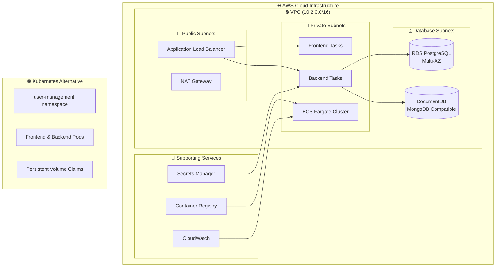
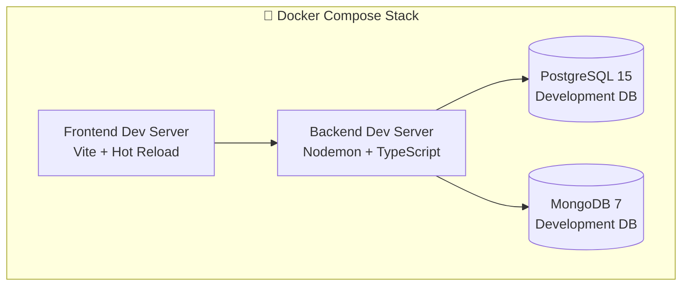
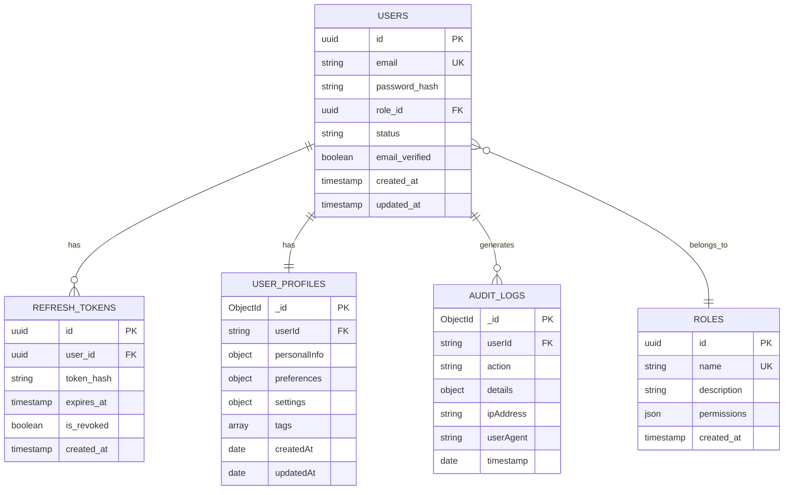
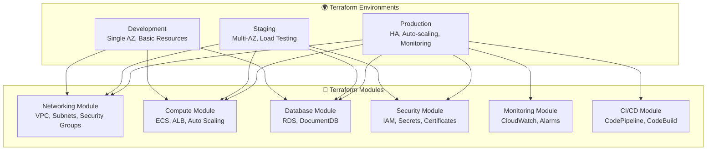
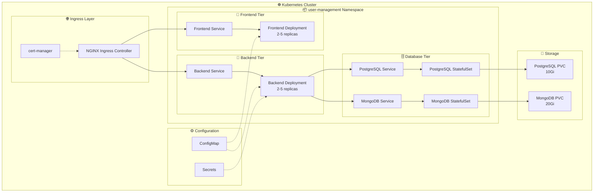
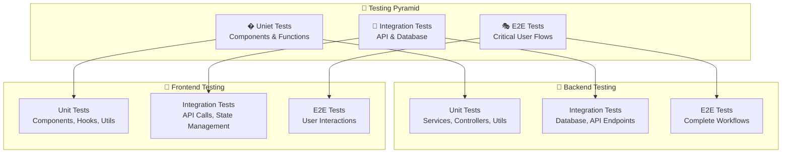

# 🚀 Enterprise User Management System

<div align="center">


**A production-ready user management system with enterprise-grade authentication, multi-database architecture, and complete AWS infrastructure automation**

</div>

---

## 📋 Table of Contents

1. [🏗️ System Architecture](#%EF%B8%8F-system-architecture)
2. [📁 Project Structure](#-project-structure)
3. [🔧 Technology Stack](#-technology-stack)
4. [🌟 Key Features](#-key-features)
5. [🚀 Quick Start](#-quick-start)
6. [🗄️ Database Architecture](#%EF%B8%8F-database-architecture)
7. [☁️ AWS Infrastructure](#%EF%B8%8F-aws-infrastructure)
8. [⚡ Kubernetes Deployment](#-kubernetes-deployment)
9. [🧪 Testing Strategy](#-testing-strategy)

---

## 🏗️ System Architecture

### Production Architecture



### Local Development Architecture



---

## 📁 Project Structure

```
user-management/
├── 🎨 frontend/                    # React 19 + TypeScript Frontend
│   ├── src/
│   │   ├── components/             # Reusable UI components
│   │   │   ├── admin/              # Admin-specific components
│   │   │   ├── auth/               # Authentication components
│   │   │   ├── common/             # Shared components
│   │   │   ├── layout/             # Layout components
│   │   │   ├── profile/            # User profile components
│   │   │   └── ui/                 # Base UI components
│   │   ├── contexts/               # React contexts (Auth, Theme, Toast)
│   │   ├── hooks/                  # Custom React hooks
│   │   ├── lib/                    # Utilities and configurations
│   │   ├── locales/                # i18n translations (en, es, fr)
│   │   ├── pages/                  # Page components
│   │   ├── router/                 # React Router configuration
│   │   ├── services/               # API service layer
│   │   ├── tests/                  # Frontend tests
│   │   └── types/                  # TypeScript type definitions
│   ├── Dockerfile.dev              # Development container
│   ├── Dockerfile.prod             # Production container
│   └── package.json                # Dependencies and scripts
│
├── 🔧 backend/                     # Node.js + Express Backend
│   ├── src/
│   │   ├── builders/               # Response builders
│   │   ├── config/                 # Configuration files
│   │   ├── controllers/            # Route controllers
│   │   ├── database/               # Database layer
│   │   │   ├── migrations/         # Database migrations
│   │   │   │   ├── postgres/       # PostgreSQL migrations
│   │   │   │   └── mongo/          # MongoDB migrations
│   │   │   └── seeders/            # Database seeders
│   │   │       ├── postgres/       # PostgreSQL seeders
│   │   │       └── mongo/          # MongoDB seeders
│   │   ├── dto/                    # Data Transfer Objects
│   │   ├── entities/               # Database entities
│   │   ├── errors/                 # Custom error classes
│   │   ├── formatters/             # Response formatters
│   │   ├── interfaces/             # TypeScript interfaces
│   │   ├── middleware/             # Express middleware
│   │   ├── repositories/           # Data access layer
│   │   ├── routes/                 # API routes
│   │   ├── services/               # Business logic layer
│   │   ├── tests/                  # Backend tests
│   │   ├── translations/           # Backend i18n
│   │   ├── types/                  # TypeScript types
│   │   └── utils/                  # Utility functions
│   ├── tests/                      # Test configurations
│   ├── docs/                       # API documentation
│   ├── database/                   # Database initialization
│   ├── Dockerfile.dev              # Development container
│   ├── Dockerfile.prod             # Production container
│   └── package.json                # Dependencies and scripts
│
├── 🏗️ infrastructure/              # Infrastructure as Code
│   ├── terraform/                  # Terraform configurations
│   │   ├── environments/           # Environment-specific configs
│   │   │   ├── dev/                # Development environment
│   │   │   ├── staging/            # Staging environment
│   │   │   └── prod/               # Production environment
│   │   ├── modules/                # Reusable Terraform modules
│   │   │   ├── networking/         # VPC, subnets, security groups
│   │   │   ├── compute/            # ECS, ALB, auto-scaling
│   │   │   ├── database/           # RDS, DocumentDB
│   │   │   ├── security/           # IAM, secrets, certificates
│   │   │   ├── monitoring/         # CloudWatch, logging
│   │   │   └── cicd/               # CodePipeline, CodeBuild
│   │   ├── shared/                 # Shared configurations
│   │   └── scripts/                # Deployment scripts
│   ├── kubernetes/                 # Kubernetes manifests
│   │   ├── namespace.yaml          # Namespace definition
│   │   ├── deployments.yaml        # Application deployments
│   │   ├── services.yaml           # Service definitions
│   │   ├── ingress.yaml            # Ingress configuration
│   │   ├── configmap.yaml          # Configuration maps
│   │   ├── secrets.yaml            # Secret definitions
│   │   └── persistent-volumes.yaml # Storage definitions
│   ├── docker/                     # Docker configurations
│   │   ├── docker-compose.dev.yml  # Development stack
│   │   ├── docker-compose.prod.yml # Production stack
│   │   └── nginx/                  # Nginx configurations
│   ├── scripts/                    # Infrastructure scripts
│   └── aws/                        # AWS-specific documentation
│
├── 📚 docs/                        # Project documentation
└── 🔧 Configuration Files
    ├── .gitignore                  # Git ignore rules
    ├── README.md                   # This file
    └── .vscode/                    # VS Code settings
```

---

## 🔧 Technology Stack

### 🎨 Frontend Stack
- **React 19** - Latest React with concurrent features
- **TypeScript 5.8** - Type safety and enhanced DX
- **Vite 7.1** - Lightning-fast build tool
- **TailwindCSS 3.4** - Utility-first CSS framework
- **TanStack Query 5.89** - Server state management
- **React Hook Form** - Performant form handling
- **React Router 6** - Client-side routing
- **i18next** - Internationalization (EN, ES, FR)
- **Vitest** - Fast unit testing

### 🔧 Backend Stack
- **Node.js 20+** - JavaScript runtime with latest features
- **Express.js 4.18** - Minimal web framework
- **TypeScript 5.1** - Type safety for backend
- **JWT** - Stateless authentication
- **bcryptjs** - Password hashing
- **Winston 3.17** - Structured logging
- **Swagger/OpenAPI** - API documentation
- **Jest 29.6** - Testing framework
- **class-validator** - DTO validation

### 🗄️ Database Stack
- **PostgreSQL 15** - ACID-compliant relational database
  - Users, roles, authentication data
  - Refresh tokens and audit logs
- **MongoDB 7** - Document database
  - User profiles and preferences
  - Dynamic content and metadata

### 🏗️ Infrastructure Stack
- **Docker & Docker Compose** - Containerization
- **AWS ECS Fargate** - Serverless containers
- **Terraform 1.5+** - Infrastructure as Code
- **Kubernetes 1.28** - Container orchestration
- **AWS RDS** - Managed PostgreSQL
- **AWS DocumentDB** - Managed MongoDB
- **AWS ALB** - Load balancing
- **AWS VPC** - Network isolation
- **AWS Secrets Manager** - Secret management
- **AWS CloudWatch** - Monitoring and logging

---

## 🌟 Key Features

### 🔐 Authentication & Security
- JWT Authentication with refresh token rotation
- Role-based access control (RBAC) - Super Admin, Admin, User, Guest
- Password strength validation and bcrypt hashing
- Rate limiting and security headers
- Input validation and SQL injection prevention
- Account lockout after failed login attempts

### 👥 User Management
- Complete user profiles with MongoDB storage
- Admin dashboard for user management
- Account status management (Active/Inactive/Suspended)
- Audit logging for all user actions
- Advanced search and filtering capabilities
- Bulk operations and data export

### 🌍 Internationalization & UX
- Multi-language support (English, Spanish, French)
- Dynamic language switching
- Responsive design (mobile-first approach)
- Dark/light theme support
- Accessibility compliant (WCAG 2.1 AA)
- Modern UI with TailwindCSS

---

## 🚀 Quick Start

### � uOption 1: Docker Development (Recommended)

```bash
# Clone the repository
git clone https://github.com/aathil-ali/User-Management.git
cd "User-Management"

# Start the complete stack
docker compose -f infrastructure/docker/docker-compose.dev.yml up -d

# Monitor services
docker compose -f infrastructure/docker/docker-compose.dev.yml logs -f

# ✅ Services available at:
# 🎨 Frontend: http://localhost:3000
# 🔧 Backend:  http://localhost:8000
# � API Dodcs: http://localhost:8000/api-docs
# 🏥 Health:   http://localhost:8000/health
```

### 🔧 Option 2: Local Development

```bash
# Start databases only
cd backend && docker compose up -d

# Backend setup
npm install && cp .env.example .env
npm run db:fresh  # Setup and seed databases
npm run dev      # Start backend server

# Frontend setup (new terminal)
cd ../frontend && npm install
npm run dev      # Start frontend server
```

### 📊 Health Check

```bash
# Check all services
curl http://localhost:8000/health
curl http://localhost:3000

# View logs
docker logs user-mgmt-backend-dev
docker logs user-mgmt-postgres-dev
docker logs user-mgmt-mongo-dev
```

---

## 🗄️ Database Architecture

### Dual Database Strategy

Our system uses a hybrid database approach optimized for different data types:



### Database Commands

```bash
cd backend

# 🚀 Quick Setup
npm run db:fresh              # Fresh install: migrate + seed
npm run db:reset              # Nuclear option: drop + fresh

# 📊 Status & Health
npm run db:status             # Check migration status
npm run db:validate           # Validate connections

# 🔄 Migrations
npm run db:migrate            # Run pending migrations
npm run db:migrate:rollback   # Rollback last migration

# 🌱 Seeders
npm run db:seed               # Insert demo data
npm run db:seed:rollback      # Remove seeded data
```

### Default Users After Seeding

| Role | Email | Password | Permissions |
|------|-------|----------|-------------|
| **Super Admin** | `admin@usermanagement.local` | `AdminPassword123!` | Full system access, user management, system settings |
| **Admin** | `demo.admin@usermanagement.local` | `DemoAdmin123!` | User management, reports, moderate content |
| **User** | `john.doe@example.com` | `DemoUser123!` | Profile management, basic features |
| **User** | `jane.smith@example.com` | `DemoUser123!` | Profile management, basic features |
| **Guest** | `guest@example.com` | `GuestUser123!` | Read-only access, limited features |

---

## ☁️ AWS Infrastructure

### Terraform Modules Architecture

Our AWS infrastructure is built with modular Terraform configurations:



### AWS Services Used

| Service | Purpose | Environment | Configuration |
|---------|---------|-------------|---------------|
| **VPC** | Network isolation | All | 10.2.0.0/16 CIDR |
| **ECS Fargate** | Container orchestration | All | Auto-scaling 2-10 tasks |
| **Application Load Balancer** | Load balancing | All | Multi-AZ, health checks |
| **RDS PostgreSQL** | Primary database | All | Multi-AZ in prod |
| **DocumentDB** | MongoDB-compatible | All | Cluster mode |
| **Secrets Manager** | Secret management | All | Auto-rotation enabled |
| **CloudWatch** | Monitoring & logging | All | Custom dashboards |
| **ECR** | Container registry | All | Vulnerability scanning |
| **Route 53** | DNS management | Prod | Health checks |
| **CloudFront** | CDN | Prod | Global edge locations |
| **CodePipeline** | CI/CD pipeline | Prod | Multi-stage deployment |

### Infrastructure Deployment

```bash
# 🔧 Development Environment
cd infrastructure/terraform/environments/dev
terraform init
terraform plan -var-file="terraform.tfvars"
terraform apply -auto-approve

# 🎭 Staging Environment
cd ../staging
terraform init
terraform plan -var-file="staging.tfvars"
terraform apply

# 🚀 Production Environment
cd ../prod
terraform init
terraform plan -var-file="prod.tfvars"
terraform apply

# 📊 View Infrastructure
terraform output
terraform show
```

### Environment Specifications

| Environment | ECS Tasks | RDS Instance | DocumentDB | Monthly Cost |
|-------------|-----------|--------------|------------|--------------|
| **Development** | 1 Frontend, 1 Backend | db.t3.micro | 1 instance | ~$80 |
| **Staging** | 2 Frontend, 2 Backend | db.t3.small | 2 instances | ~$200 |
| **Production** | 3-10 Frontend, 3-15 Backend | db.r5.large Multi-AZ | 3 instance cluster | ~$500+ |

---

## ⚡ Kubernetes Deployment

### Kubernetes Architecture

Our Kubernetes setup provides an alternative to AWS ECS:



### Kubernetes Deployment Commands

```bash
# 🚀 Deploy Complete Stack
cd infrastructure/kubernetes

# Create namespace and basic resources
kubectl apply -f namespace.yaml
kubectl apply -f configmap.yaml
kubectl apply -f secrets.yaml

# Deploy storage
kubectl apply -f persistent-volumes.yaml

# Deploy applications
kubectl apply -f deployments.yaml
kubectl apply -f services.yaml
kubectl apply -f ingress.yaml

# 📊 Monitor Deployment
kubectl get pods -n user-management -w
kubectl get services -n user-management
kubectl logs -f deployment/backend-deployment -n user-management

# 🔄 Update Applications
kubectl set image deployment/frontend-deployment frontend=your-registry/frontend:v2.0 -n user-management
kubectl rollout status deployment/frontend-deployment -n user-management

# 📈 Scale Applications
kubectl scale deployment frontend-deployment --replicas=5 -n user-management
kubectl scale deployment backend-deployment --replicas=8 -n user-management
```

### Resource Specifications

| Component | CPU Request | CPU Limit | Memory Request | Memory Limit | Replicas |
|-----------|-------------|-----------|----------------|--------------|----------|
| **Frontend** | 100m | 200m | 128Mi | 256Mi | 2-5 |
| **Backend** | 250m | 500m | 256Mi | 512Mi | 2-5 |
| **PostgreSQL** | 250m | 500m | 512Mi | 1Gi | 1 |
| **MongoDB** | 250m | 500m | 512Mi | 1Gi | 1 |

---

## 🧪 Testing Strategy

### Comprehensive Testing Suite

Our testing strategy follows the testing pyramid with extensive coverage:



### Testing Commands

| Test Type | Backend | Frontend | Coverage Target |
|-----------|---------|----------|-----------------|
| **Unit Tests** | `npm run test:unit` | `npm test` | > 90% |
| **Integration Tests** | `npm run test:integration` | `npm run test:integration` | > 80% |
| **E2E Tests** | `npm run test:e2e` | `npm run test:e2e` | > 70% |
| **All Tests** | `npm run test:all` | `npm run test:all` | > 85% |
| **Coverage Report** | `npm run test:coverage` | `npm run test:coverage` | Detailed HTML |
| **Watch Mode** | `npm run test:watch` | `npm run test:ui` | Development |

---

## 🎯 Essential Commands Reference

```bash
# 🐳 Docker Operations
docker compose -f infrastructure/docker/docker-compose.dev.yml up -d
docker compose -f infrastructure/docker/docker-compose.dev.yml down
docker compose -f infrastructure/docker/docker-compose.dev.yml logs -f

# 🗄️ Database Management
cd backend
npm run db:fresh              # Fresh setup with demo data
npm run db:reset              # Nuclear reset
npm run db:status             # Check health
npm run db:migrate            # Run migrations
npm run db:seed               # Insert demo data

# 🧪 Testing
npm run test                  # All tests
npm run test:unit             # Unit tests only
npm run test:integration      # Integration tests
npm run test:e2e              # End-to-end tests
npm run test:coverage         # Coverage report

# 🏗️ Infrastructure Deployment
cd infrastructure/terraform/environments/dev
terraform init && terraform plan && terraform apply

# ☸️ Kubernetes Deployment
cd infrastructure/kubernetes
kubectl apply -f .
kubectl get pods -n user-management

# 🔧 Development
cd frontend && npm run dev    # Frontend dev server
cd backend && npm run dev     # Backend dev server
```

---

## 📚 Documentation & Support

| Resource | Description | Link |
|----------|-------------|------|
| **API Documentation** | Interactive Swagger docs | [localhost:8000/api-docs](http://localhost:8000/api-docs) |
| **Frontend README** | Frontend-specific documentation | [frontend/README.md](frontend/README.md) |
| **Backend README** | Backend-specific documentation | [backend/README.md](backend/README.md) |
| **Infrastructure Guide** | Deployment and infrastructure | [infrastructure/README.md](infrastructure/README.md) |
| **Contributing Guide** | How to contribute | [CONTRIBUTING.md](CONTRIBUTING.md) |
| **License** | MIT License details | [LICENSE](LICENSE) |

---

## 🤝 Contributing

1. Fork the repository
2. Create a feature branch: `git checkout -b feature/amazing-feature`
3. Make your changes and test thoroughly
4. Commit your changes: `git commit -m 'Add amazing feature'`
5. Push to the branch: `git push origin feature/amazing-feature`
6. Open a Pull Request

---

## 📝 License

This project is licensed under the MIT License - see the [LICENSE](LICENSE) file for details.

---

<div align="center">

**⭐ If you found this project helpful, please give it a star!**

**Built with modern technologies and enterprise-grade architecture**

*Made with ❤️ for the developer community*

</div>